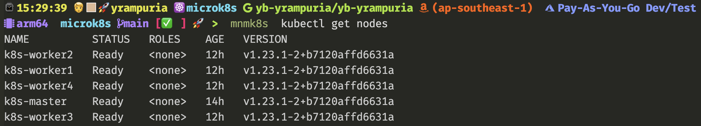

# mnmk8s: Multi-node Microk8s



This project creates VM based cluster on Mac (and may be linux). It uses Canonical stack.
Microk8s does not make it easy to have multi-node cluster (like minikube). So, this project is addressing that gap.

## Nodes Specifications

| Nodes       | vCPU | RAM (GB) | Disk (GB) | Cloud Init                      | Description   | Group(s)             |
| ----------- | ---- | -------- | --------- | ------------------------------- | ------------- | -------------------- |
| k8s-master  | 2    | 8        | 40        | config/microk8s-cloud-init.yaml | K8s Master    | all, k8s             |
| k8s-worker1 | 2    | 8        | 40        | config/microk8s-cloud-init.yaml | K8s Worker #1 | all, k8s, k8s-worker |
| k8s-worker2 | 2    | 8        | 40        | config/microk8s-cloud-init.yaml | K8s Worker #2 | all, k8s, k8s-worker |
| k8s-worker3 | 2    | 8        | 40        | config/microk8s-cloud-init.yaml | K8s Worker #3 | all, k8s, k8s-worker |
| k8s-worker4 | 2    | 8        | 40        | config/microk8s-cloud-init.yaml | K8s Worker #4 | all, k8s, k8s-worker |
| k8s-jumpbox | 2    | 4        | 50        |                                 | K8s Jumpbox   | all, general         |
| k8s-storage | 2    | 4        | 50        |                                 | K8s Storage   | all, general         |

## Pre-requisites

- Lots of RAM (>= 32GB)

- Mac (or Linux - not tested)

- Homebrew

- multipass (`brew install multipass`)

## Get Started

```bash
git clone <project-repo> microk8s
cd microk8s
# Edit
scripts/mnmk8s init
```

## Cleanup

```bash
scripts/mnmk9s destroy
```

## Daily Drivers

| Pupose                                             | Command                                      |
| -------------------------------------------------- | -------------------------------------------- |
| Start of Day                                       | `scripts/mnmk8s sod`                         |
| End of Day                                         | `scripts/mnmk8s eod`                         |
| Start a node (k8s-master)                          | `scripts/mnmk8s start k8s-master`            |
| Stop a node (k8s-master)                           | `scripts/mnmk8s stop k8s-master`             |
| Restart a node (k8s-master)                        | `scripts/mnmk8s restart k8s-master`          |
| Execute command (uname -a) on a node (k8s-master)  | `scripts/mnmk8s exec k8s-master uname -a`    |
| Execute command (uname -a) on a node (k8s-master)  | `scripts/mnmk8s exec k8s-master uname -a`    |
| Goto shell on a node (k8s-master)                  | `scripts/mnmk8s shell k8s-master`            |
| Update Hosts file on a node (k8s-master)           | `scripts/mnmk8s update-host k8s-master`      |
| Mount disks on a node (k8s-master)                 | `scripts/mnmk8s mount-storage`               |
| Execute task (start) async on a node (k8s-master)  | `scripts/mnmk8s async start k8s-master`      |
| (Re)Join a worker to k8s (k8s-worker1)             | `scripts/mnmk8s join-k8s-master k8s-worker1` |
| _Bulk_ Execute command (uname -a) on a group (k8s) | `scripts/mnmk8s on k8s exec uname -a`        |
| _Bulk_ Execute command (uname -a) on all nodes     | `scripts/mnmk8s on all exec uname -a`        |
| Destroy it all                                     | `scripts/mnmk8s destroy`                     |
